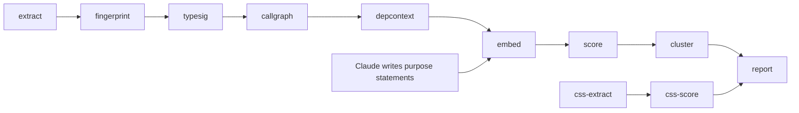

# Architecture

drift is a multi-stage pipeline that detects semantic duplication in TypeScript/React codebases. It has three runtime components orchestrated by a bash CLI.

## Components

### extractor/ — TypeScript (ts-morph)

Parses the full codebase AST and extracts all exported code units. Each unit captures:

- **Identity** — name, kind (component/hook/function/class/type/constant/enum), file path, line range
- **Types** — parameter types, return type, generics
- **JSX** — tree structure with map/conditional markers, leaf elements, depth
- **Hooks** — React built-in and custom hook calls with counts
- **Imports** — categorized as framework, external (npm), or internal
- **Call graph** — outbound callees with context (render/effect/handler/init/conditional), sequences per context, chain patterns, depth profile
- **Consumer graph** — inbound: who imports this unit, their kinds and directories, co-occurrence ratios
- **Behavior** — async, error handling, loading/empty states, retry logic, iteration/conditional rendering, side effects

Output: `code-units.json`

### pipeline/ — Python (numpy, scipy, networkx)

Processes extracted units through fingerprinting, scoring, clustering, and reporting stages. See [Pipeline Stages](#pipeline-stages) below.

Python 3.10+ is auto-discovered at runtime — the CLI searches (in order): existing venv, system `python3`, uv-managed python, pyenv, conda, versioned binaries (`python3.14` down to `python3.10`), and mise/asdf shims. If the discovered python lacks the `venv` module (common on Debian/Ubuntu minimal installs), the CLI falls back to `uv venv` for virtual environment creation.

### ast-grep/ — YAML rules + bash runner

Structural pattern matching as an additive scoring signal. Scans for common code shapes:

- **Component patterns** — button bars, list-with-map, modal wrappers, detail panels
- **State patterns** — multi-useState, Zustand stores, store selectors
- **Async patterns** — fetch-with-state, promise chains, async callbacks
- **Error handling** — try/catch wrappers, error boundary patterns
- **Data loading** — Dexie queries, worker messages

Output: `structural-patterns.json` (mapping of unit ID to pattern tag array)

## Pipeline Stages

### Stage 1: Extract

TypeScript/ts-morph. Parses all source files, extracts exported code units with full metadata. Handles monorepos with multiple tsconfig.json files. Performance: 10-30 seconds for 200K lines.

### Stage 1b: CSS Extract

Regex-based CSS parser. Walks the project for `.css` files, parses rules with selectors and declarations, computes per-rule fingerprints and per-file aggregates. Links CSS files to importing JS/TS components via `code-units.json`.

Per-rule: `propertyValueHash` (exact match), `propertySetHash` (value-agnostic match).

Per-file: `selectorPrefixes` (BEM), `customPropertyDeclarations/References`, `propertyFrequency`, `categoryProfile` (7-element vector: layout, spacing, sizing, typography, visual, positioning, animation).

### Stage 2a: Fingerprint

Computes structural fingerprints per unit from Stage 1 data:

| Fingerprint | Description |
|-------------|-------------|
| jsxHash | Exact and fuzzy hashes of JSX tree structure |
| hookProfile | Fixed-length vector of React hook call counts |
| importConstellation | Sparse vector of imports, IDF-weighted by specificity |
| behaviorFlags | Binary vector of behavior markers |
| dataAccessPattern | Sparse vector over store/database vocabulary |

### Stage 2b: Embed

Embeds purpose statements written by Claude into vectors for semantic comparison. Uses built-in TF-IDF by default (no external services). Optionally uses Ollama for higher-quality embeddings (`--ollama-url`). Runs automatically as part of `drift run` — skips gracefully if no purpose statements exist yet.

### Stage 2c: Type Signatures

Normalizes type signatures by stripping identifiers. Produces three matching tiers:

- **Strict hash** — exact normalized signature match
- **Loose hash** — same arity and primitive categories
- **Canonical string** — human-readable form like `(string, number) => void`

### Stage 2d: Call Graph

Computes call graph vectors from extracted callee data:

- Callee set vector (IDF-weighted by specificity)
- Call sequences per context (render, effect, handler)
- Sequence hashes, chain pattern hashes
- Depth profile

### Stage 2e: Dependency Context

Builds dependency context from the consumer graph:

- Consumer profile — normalized count, kind entropy (Shannon), directory spread
- Co-occurrence vector — how often units are imported together
- Neighborhood hashes at radius 1 and 2 (BFS over import graph)

### Stage 3: Score

Pairwise similarity across all comparable unit pairs. Computes 13 signals with adaptive weighting. Filters: skips same-file pairs, incompatible kinds, and pairs below threshold (default 0.35).

See [Similarity Signals](#similarity-signals) for details.

### Stage 3b: CSS Score & Cluster

Pairwise CSS similarity across 6 signals:

| Signal | Weight | Method | Catches |
|--------|--------|--------|---------|
| ruleExactMatch | 0.30 | Dice on propertyValueHash multisets | Exact copy-paste, renamed selectors |
| ruleSetMatch | 0.25 | Dice on propertySetHash multisets | Same props, different values/vars |
| propertyFrequency | 0.20 | Cosine on property-name frequency vectors | Files using same properties |
| categoryProfile | 0.10 | Cosine on category vectors | Files styling same kinds of things |
| customPropertyVocab | 0.10 | Jaccard on custom-property reference sets | Files consuming same design tokens |
| selectorPrefixOverlap | 0.05 | Jaccard on prefix sets | Naming convention similarity |

Threshold: 0.40. Clustering reuses the same NetworkX community detection as Stage 4.

### Stage 4: Cluster

Graph-based community detection using NetworkX:

1. Build weighted graph from scored pairs
2. Connected components for initial grouping
3. Greedy modularity for large clusters (>5 members)
4. Enrich each cluster: avg similarity, signal breakdown, directory spread, kind mix, shared callees, consumer overlap
5. Rank by `memberCount * avgSimilarity * directorySpread * kindBonus`

### Stage 5: Verify (Claude Code skill, not a tool stage)

Claude reads cluster members' source code and assesses semantic equivalence. Writes `findings.json` with verdicts: DUPLICATE, OVERLAPPING, RELATED, or FALSE_POSITIVE.

### Stage 6: Report

Generates final output from all artifacts (including `css-clusters.json` and `findings.json` if present):

- `semantic-drift-report.md` — human-readable findings (JS/TS and CSS sections)
- `drift-manifest.json` — structured entries (`"type": "semantic"` and `"type": "css"`)
- `dependency-atlas.json` — graph structure for visualization

## Similarity Signals

| Signal | Method | Scope |
|--------|--------|-------|
| typeSignature | Hash match: strict (1.0), loose (0.7), arity (0.4) | All |
| jsxStructure | Tree similarity: exact hash, fuzzy hash, or node matching | Components only |
| hookProfile | Cosine similarity on hook call count vectors | Components/hooks |
| importConstellation | Cosine similarity on IDF-weighted import vectors | All |
| dataAccess | Jaccard on data source/store sets | All |
| behaviorFlags | Normalized Hamming distance | All |
| calleeSet | Cosine similarity on IDF-weighted callee vectors | All |
| callSequence | LCS-based or hash match on ordered call sequences | All |
| consumerSet | Jaccard on consumer sets + cross-directory bonus | All |
| coOccurrence | Cosine similarity on co-occurrence vectors | All |
| neighborhood | Hash match at radius 1 (1.0) or radius 2 (0.6) | All |
| structuralPattern | Jaccard on ast-grep pattern tags | If ast-grep available |
| semantic | Cosine similarity on purpose statement embeddings | If embeddings available |

### Weight Adaptation

Weights adapt automatically based on context:

- **Embeddings present**: semantic signal gets 0.20, other weights scale down
- **Component pairs**: jsxStructure and hookProfile included
- **Non-component pairs**: component-only signals dropped, remaining weights renormalize to 1.0
- **ast-grep available**: structuralPattern signal added
- **Cross-kind pairs**: only comparable kinds scored (component-hook, hook-function, same-kind)

## Output Artifacts

All artifacts are written to `$DRIFT_OUTPUT_DIR` (default: `.drift-audit/semantic/`).

| Artifact | Stage | Description |
|----------|-------|-------------|
| `code-units.json` | Extract | All extracted units with full metadata |
| `structural-fingerprints.json` | Fingerprint | JSX hashes, hook profiles, import constellations |
| `type-signatures.json` | Typesig | Normalized type hashes |
| `call-graph.json` | Callgraph | Callee vectors, sequences, chain patterns |
| `dependency-context.json` | Depcontext | Consumer profiles, co-occurrence, neighborhoods |
| `semantic-embeddings.json` | Embed | Purpose statement embeddings (TF-IDF or Ollama) |
| `structural-patterns.json` | ast-grep | Pattern tags per unit (optional) |
| `similarity-matrix.json` | Score | Scored pairs above threshold |
| `clusters.json` | Cluster | Ranked communities with enrichment |
| `css-units.json` | CSS Extract | Parsed CSS rules, fingerprints, file aggregates |
| `css-similarity.json` | CSS Score | Scored CSS file pairs above threshold |
| `css-clusters.json` | CSS Score | Clustered CSS file groups |
| `semantic-drift-report.md` | Report | Human-readable findings |
| `drift-manifest.json` | Report | Structured finding entries |
| `dependency-atlas.json` | Report | Graph for visualization |
| `purpose-statements.json` | Claude | One-sentence unit descriptions (written by skill) |
| `findings.json` | Claude | Verification verdicts (written by skill) |
