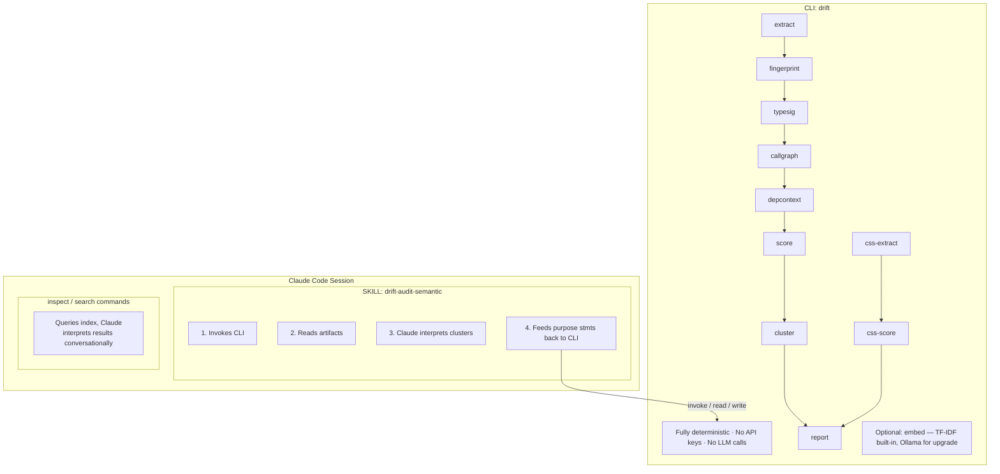
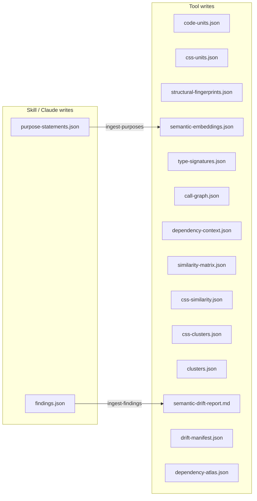

# Design Document

### Problem

A large TypeScript/React codebase contains semantic duplication — the same
functional concept implemented independently under different names, APIs, and
structures. Detection requires understanding what code DOES, not what it's named.

### Design Principles

**The tool is deterministic.** It parses code, computes structural features,
builds graphs, calculates similarity scores, and produces clusters. It makes
zero LLM calls by default. Same input → same output, every time.

**Claude Code is the semantic layer.** Purpose statements, semantic verification,
and architectural interpretation happen in the Claude Code session — where the
user is already paying for inference and where the LLM already has full project
context. The skill orchestrates: run tool → read structured output → Claude
interprets → optionally feed interpretation back to tool.

**No per-token API costs.** The tool requires no API keys in its default
configuration. Purpose statement embedding uses built-in TF-IDF. If the
user wants higher-quality embeddings, they can configure a local Ollama URL.
Everything else is pure computation.

---

## Architecture



---

## What the Tool Does vs What Claude Does

| Concern | Tool (deterministic) | Claude Code (semantic) |
|---------|---------------------|----------------------|
| Parse AST, resolve types | ✓ | |
| Extract call graph | ✓ | |
| Build consumer/co-occurrence graph | ✓ | |
| Structural fingerprinting | ✓ | |
| Type signature normalization | ✓ | |
| Pairwise similarity scoring | ✓ | |
| Clustering | ✓ | |
| CSS extraction and scoring | ✓ | |
| Generate purpose statements | | ✓ (reads code, writes statements) |
| Embed purpose statements | ✓ (TF-IDF or Ollama) | |
| Verify cluster equivalence | | ✓ (reads cluster + source code) |
| Present findings to user | | ✓ |
| Decide what to consolidate | | ✓ (with user) |

---

## Pipeline Stages

### Stage 1: EXTRACT (tool)

ts-morph parses the full codebase and extracts all exported code units.

**Extracts per unit:**

```
Identity:
  - id, name, kind, filePath, lineRange, sourceCode

Type Information:
  - parameters/props (name, resolved type, optionality)
  - returnType (resolved)
  - generics, type alias chain

Structure (components):
  - jsxTree: tag nesting with map/conditional markers, attributes stripped
  - jsxLeafElements, jsxDepth

Hooks & State:
  - hookCalls (ordered, with counts)
  - customHookCalls (project-internal use* calls)
  - stateVariableCount

Dependencies:
  - imports (external + internal, categorized)
  - storeAccess (reads + writes)
  - dataSourceAccess

Call Graph (outbound):
  - callees: ordered list with resolved target, call expression, position,
    and context (render | effect | handler | init | conditional)
  - calleeSequence: ordered target ids per context
  - callDepth, uniqueCallees
  - chainPatterns: method chains with identifiers wildcarded
    e.g., "db.*.where().equals().toArray()"

Dependency Context (inbound):
  - consumers: units that import and reference this unit
  - consumerCount, consumerKinds, consumerDirectories
  - coOccurrences: units frequently imported alongside this one,
    with count and ratio

Behavior Markers:
  - isAsync, hasErrorHandling, hasLoadingState, hasEmptyState,
    hasRetryLogic, rendersIteration, rendersConditional, sideEffects
```

**Output:** `code-units.json`

**Performance:** 10-30 seconds for 200K lines. The call graph and consumer
graph reuse the same AST traversal and add marginal time.

### Stage 1b: CSS EXTRACT (tool)

Regex-based CSS parser. Walks the project for `.css` files (skipping
`node_modules/`, `dist/`, and test directories), parses rules into selectors
and declaration blocks, and computes inline fingerprints.

**Per-rule:** `propertyValueHash` (SHA-256 of sorted `prop:value` pairs — catches
exact copies) and `propertySetHash` (SHA-256 of sorted property names — catches
near-copies with different values).

**Per-file aggregates:** `selectorPrefixes` (BEM), `customPropertyDeclarations` /
`customPropertyReferences`, `propertyFrequency` (sparse vector of property-name
counts), `categoryProfile` (7-element vector: layout, spacing, sizing, typography,
visual, positioning, animation).

**Component linking:** Reads `code-units.json` import data to populate `importedBy`
on each CSS unit.

**Output:** `css-units.json`

### Stage 2a: STRUCTURAL FINGERPRINT (tool)

Computed per unit from Stage 1 data:

- **JSX structure hash** (exact + fuzzy with custom tags wildcarded)
- **Hook profile vector** (fixed-length, React built-in hook call counts)
- **Import constellation vector** (sparse, auto-weighted by specificity)
- **Behavior flag vector** (binary)
- **Data access pattern** (sparse vector over store/db vocabulary)

**Output:** `structural-fingerprints.json`

### Stage 2b: SEMANTIC EMBED (tool, optional)

**Only runs if purpose statements exist.** Uses built-in TF-IDF by default.
Optionally uses Ollama for higher-quality embeddings if `--ollama-url` is provided.

The skill generates purpose statements (Claude reads code, writes one-sentence
descriptions). The tool embeds them for semantic comparison. This stage is not
required — the scoring stage adapts its weights based on available signals.

```bash
# Built-in TF-IDF (default, no external services):
drift embed

# Higher-quality embeddings via Ollama (optional):
drift embed --ollama-url http://localhost:11434 --model nomic-embed-text
```

**Input:** `purpose-statements.json` (written by skill)
**Output:** `semantic-embeddings.json`

### Stage 2c: TYPE SIGNATURE (tool)

Normalized type hashes with identifiers stripped:

- **Strict hash:** exact structural match after name stripping
- **Loose hash:** arity + primitives + function shape only
- **Canonical string:** human-readable normalized form

Applied to both parameter types and return types.

**Output:** `type-signatures.json`

### Stage 2d: CALL GRAPH (tool)

Computed per unit from Stage 1 call data:

- **Callee set vector** (sparse, specificity-weighted like imports)
- **Call sequences per context** (render, effect, handler — ordered target lists)
- **Sequence hashes** (for exact match)
- **Chain pattern hashes** (wildcarded method chains)
- **Depth profile** ([direct, depth-2, depth-3+] call counts)
- **Consumer-caller overlap** (does this unit call things its consumers also call directly?)

**Output:** `call-graph.json`

### Stage 2e: DEPENDENCY CONTEXT (tool)

Computed per unit from Stage 1 consumer/co-occurrence data:

- **Consumer profile vector** (normalized count, kind entropy, directory spread)
- **Co-occurrence vector** (sparse, over all units — which units appear alongside this one)
- **Neighborhood hash** at radius 1 and radius 2

**Output:** `dependency-context.json`

### Stage 3: SCORE (tool)

Pairwise similarity across all units using all available signals.

**Signals and similarity functions:**

| Signal | Function | Notes |
|--------|----------|-------|
| semantic | cosine similarity on embeddings | Only if embeddings exist |
| typeSignature | hash match (strict→1.0, loose→0.7, arity overlap→0.4) | |
| jsxStructure | tree edit distance, normalized | Components only |
| hookProfile | cosine similarity on hook vectors | Components/hooks only |
| importConstellation | cosine similarity on weighted import vectors | |
| dataAccess | Jaccard on data source sets | |
| behaviorFlags | normalized Hamming distance | |
| calleeSet | cosine similarity on weighted callee vectors | |
| callSequence | LCS length / max sequence length, per context | |
| consumerSet | Jaccard on consumer sets, bonus for cross-directory | |
| coOccurrence | cosine similarity on co-occurrence vectors | |
| neighborhood | hash match (r1→1.0, r2→0.6, else Jaccard fallback) | |

**Adaptive weight matrix:**

When all signals available (component):

```
semantic:       0.20    ←  only when embeddings present
typeSignature:  0.12
jsxStructure:   0.13
hookProfile:    0.05
imports:        0.05
dataAccess:     0.03
behavior:       0.02
calleeSet:      0.10
callSequence:   0.10
consumerSet:    0.08
coOccurrence:   0.07
neighborhood:   0.05
```

When semantic embeddings unavailable, the 0.20 redistributes:

```
typeSignature:  0.16  (+0.04)
jsxStructure:   0.16  (+0.03)
hookProfile:    0.06  (+0.01)
imports:        0.06  (+0.01)
dataAccess:     0.04  (+0.01)
behavior:       0.02
calleeSet:      0.13  (+0.03)
callSequence:   0.13  (+0.03)
consumerSet:    0.10  (+0.02)
coOccurrence:   0.08  (+0.01)
neighborhood:   0.06  (+0.01)
```

Cross-kind pairs (component↔hook, hook↔function) drop inapplicable signals
(jsx, hookProfile) and renormalize.

**Output:** `similarity-matrix.json` — pairs above threshold with per-signal
breakdown and dominant signal family tag.

### Stage 4: CLUSTER (tool)

Graph-based community detection over the similarity matrix:

1. Build graph: units as nodes, edges where similarity > threshold
2. Connected components for initial clusters
3. Sub-cluster large clusters (>5 members) by dominant signal
4. Enrich: avg similarity, signal family breakdown, directory spread,
   kind mix, shared callees, consumer overlap, call sequence alignment
5. Rank: memberCount × avgSimilarity × directorySpread × kindBonus

**Output:** `clusters.json`

### Stage 3b: CSS SCORE & CLUSTER (tool)

Pairwise CSS similarity across 6 signals:

| Signal | Weight | Method |
|--------|--------|--------|
| ruleExactMatch | 0.30 | Dice on `propertyValueHash` multisets |
| ruleSetMatch | 0.25 | Dice on `propertySetHash` multisets |
| propertyFrequency | 0.20 | Cosine on property-name frequency vectors |
| categoryProfile | 0.10 | Cosine on category vectors |
| customPropertyVocab | 0.10 | Jaccard on custom-property reference sets |
| selectorPrefixOverlap | 0.05 | Jaccard on prefix sets |

Threshold: 0.40. Clustering reuses the same NetworkX community detection as
Stage 4. Each CSS cluster is enriched with linked components, shared custom
properties, and directory spread.

**Output:** `css-similarity.json`, `css-clusters.json`

### Stage 5: VERIFY (Claude Code, via skill)

**Not a tool stage.** The skill reads `clusters.json`, Claude reads the actual
source files of cluster members, assesses semantic equivalence, and writes
structured verdicts.

For each cluster, Claude produces:
- verdict: DUPLICATE | OVERLAPPING | RELATED | FALSE_POSITIVE
- confidence
- role description
- shared behavior, meaningful differences, accidental differences
- feature gaps
- shared workflow (from call graph data)
- architectural role (from dependency context data)
- consolidation complexity and reasoning
- consumer impact

**Output:** `findings.json` (written by skill)

### Stage 6: REPORT (tool)

Reads all artifacts — including `findings.json` and `css-clusters.json` if
present — and generates:

- `semantic-drift-report.md` — human-readable findings (JS/TS and CSS sections)
- `drift-manifest.json` — structured entries (`"type": "semantic"` and `"type": "css"`)
- `dependency-atlas.json` — graph structure for visualization

If findings don't exist, generates a preliminary report from clusters alone
that shows "these are structurally similar, pending semantic verification."

---

## Data Flow



Two files flow FROM Claude TO the tool. Everything else flows FROM the tool
TO Claude. The tool has `ingest-purposes` and `ingest-findings` commands to
validate and incorporate the inbound files.

---

## CLI

```bash
# Full pipeline (deterministic stages only)
drift run --project .

# Individual stages
drift extract --project .
drift fingerprint
drift typesig
drift callgraph
drift depcontext
drift score
drift cluster
drift report

# CSS stages
drift css-extract --project .
drift css-score

# Optional embedding (TF-IDF built-in; Ollama optional)
drift embed
drift embed --ollama-url http://localhost:11434 --model nomic-embed-text

# Ingest from Claude
drift ingest-purposes --file purpose-statements.json
drift ingest-findings --file findings.json

# Inspection
drift inspect unit <unitId>
drift inspect similar <unitId> --top 10
drift inspect cluster <clusterId>
drift inspect consumers <unitId>
drift inspect callers <unitId>

# Structural search
drift search calls <unitId>
drift search called-by <unitId>
drift search co-occurs-with <unitId>
drift search type-like <unitId>
```

---

## Interaction Flows

### Full audit

```
User: "Run a semantic drift analysis"

Skill:
  1. $ drift run --project .
     → extract, fingerprint, typesig, callgraph, depcontext, embed,
       score, cluster, css-extract, css-score, report

  2. Reads clusters.json
     For top N clusters: reads source files of members, assesses equivalence

  3. Writes findings.json

  4. $ drift report   (re-generates with findings)

  5. Reads semantic-drift-report.md, presents to user
```

### Enrichment with purpose statements

```
Between steps 1 and 2 of a full audit:

  1a. Reads code-units.json, generates purpose statements for units
      in candidate clusters (Claude reads source, writes descriptions)
  1b. Writes purpose-statements.json
  1c. $ drift ingest-purposes --file purpose-statements.json
  1d. $ drift embed   (TF-IDF by default, or --ollama-url for upgrade)
  1e. $ drift score   (re-score with embeddings included)
  1f. $ drift cluster (re-cluster with new scores)
```

### Targeted exploration

```
User: "What's similar to ToolBar?"

Skill:
  1. $ drift inspect similar "src/.../ToolBar.tsx::ToolBar" --top 10
  2. Reads results, reads source files of top matches
  3. Interprets and presents conversationally
```

### Enrichment across sessions

```
Session 1: Run full pipeline, verify top 20 clusters
Session 2: "Continue verifying clusters" → verify next 20
Session 3: "Re-run with latest code changes" → run again,
           re-verify affected clusters
```

Purpose statements and findings accumulate in their JSON files across
sessions. The tool incorporates everything it's received.

---

## Dependencies

### Tool (Python)

```toml
[project]
name = "drift-semantic"
requires-python = ">=3.10"
dependencies = [
    "numpy",
    "scipy",
    "click",
    "networkx",
]

[project.optional-dependencies]
ollama = ["httpx"]
```

### Extractor (TypeScript)

```json
{
  "dependencies": {
    "ts-morph": "latest"
  }
}
```

### Total

5 packages. No API keys. No databases. No Docker. No background services.

---

## Cost

| Component | Cost |
|-----------|------|
| Tool execution | $0 |
| Ollama (if used) | $0 (local) |
| Claude Code session | Already paid for |
| **Total incremental cost** | **$0** |
