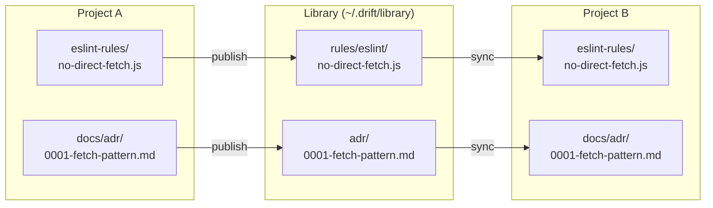

# Drift Artifact Library

The drift library centralizes guard artifacts — ESLint rules, ADRs, pattern docs, review checklists — so they propagate across projects without manual copy-paste.

## How It Works



1. **drift-guard** generates artifacts in a project
2. `drift library publish` copies them to the library
3. `drift library sync` in another project pulls artifacts into it

The library is **local-first**: it lives at `~/.drift/library/` and works immediately without any git setup. Optionally, you can make the library directory a git repo for team sharing.

## Setup

### Initialize the library

```bash
drift library init
```

This creates:

```
~/.drift/library/
  library.json              # manifest of all artifacts
  rules/
    eslint/                 # ESLint rule modules
    ruff/                   # Ruff rules (future)
    ast-grep/               # ast-grep rules (future)
  adr/                      # Architecture Decision Records
  patterns/                 # Pattern usage guides
  checklists/               # Review checklists
```

### Configure a project

`drift install-skill` creates `.drift-audit/config.json` automatically:

```json
{
  "library": "~/.drift/library",
  "sync": {
    "eslint-rule": "eslint-rules/",
    "adr": "docs/adr/",
    "pattern": "docs/patterns/",
    "checklist": "docs/"
  }
}
```

**Sync mappings** tell drift where each artifact type lives in your project. Adjust paths to match your directory conventions.

## Commands

### `drift library publish`

Scans the project's artifact directories (from `sync` mappings in config) and copies new or changed files to the library.

- Uses SHA-256 checksums to detect changes
- Skips unchanged files
- Derives artifact type from which sync mapping matched

### `drift library sync`

Pulls artifacts from the library into the project.

- Syncs all artifacts that have a matching sync mapping in the project config
- Only copies if checksum differs (library version is different from local)
- Creates destination directories if needed
- Reports what was synced

### `drift library list`

Prints all artifacts in the library, grouped by type. Shows source project and last update date.

### `drift library status`

Compares library artifacts vs the current project:

| Symbol | Meaning |
|--------|---------|
| `=` | In sync (checksums match) |
| `<` | Library is newer — run `drift library sync` |
| `>` | Project is newer — run `drift library publish` |
| `?` | Not synced (artifact exists in library but not in project) |

## Online / Offline Mode

By default, library sync is manual (offline mode). Enable **online mode** to have Claude automatically sync before audits and publish after guard phases:

```bash
drift online     # enable auto-sync
drift offline    # back to manual
```

In online mode, the CLAUDE.md instructions tell Claude to:
- Run `drift library sync` before starting any audit phase
- Run `drift library publish` after completing any guard phase

This happens silently as part of the pipeline — no confirmation prompts.

## Team Sharing

The library directory is just files on disk. To share with a team:

```bash
cd ~/.drift/library
git init
git add -A
git commit -m "Initial library"
git remote add origin <url>
git push -u origin main
```

Team members clone the same repo to `~/.drift/library/`:
```bash
git clone <url> ~/.drift/library
```

Then `drift library sync` and `drift library publish` work normally. Use `git pull`/`git push` in the library directory to share updates.

## Artifact Types

| Type | Library dir | Extensions | Description |
|------|------------|-----------|-------------|
| `eslint-rule` | `rules/eslint/` | `.js`, `.cjs`, `.mjs`, `.ts` | Custom ESLint rule modules |
| `ruff-rule` | `rules/ruff/` | `.py`, `.toml` | Ruff lint rules |
| `ast-grep-rule` | `rules/ast-grep/` | `.yml`, `.yaml` | ast-grep patterns |
| `adr` | `adr/` | `.md` | Architecture Decision Records |
| `pattern` | `patterns/` | `.md` | Pattern usage guides |
| `checklist` | `checklists/` | `.md` | Review checklists |
